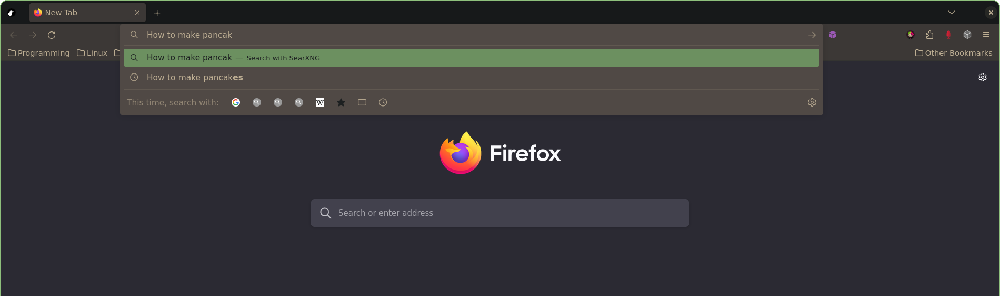
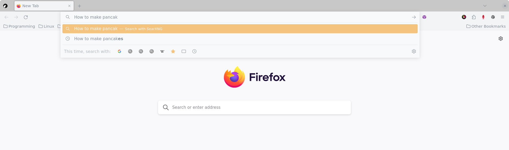

# ❄️ nix-colors-adapters

Collection of adapters for automatically applying [nix-colors](https://github.com/Misterio77/nix-colors) `base16` schemes.



A single line change later...
```diff
- colorScheme = inputs.nix-colors.colorSchemes.gruvbox-dark-hard;
+ colorScheme = inputs.nix-colors.colorSchemes.ayu-light;
```



## Install (system flake + system home-manager)

1. configure home-manager, make sure to pass `inputs` to your home module ([vimjoyer tutorial](https://www.youtube.com/watch?v=FcC2dzecovw))
2. add `nix-colors` and `nix-colors-adapters` to you `inputs` in `flake.nix`:
```
inputs = {
    ...
    nix-colors.url = "github:misterio77/nix-colors";
    nix-colors-adapters.url = "gitlab:vfosnar/nix-colors-adapters";
    ...
};
```
3. import them in your home module `home.nix`:
```
imports = [
    ...
    inputs.nix-colors.homeManagerModules.default
    inputs.nix-colors-adapters.homeManagerModules.default
    ...
];
```
4. you're done!

## Configuration (home.nix)

You can configure any `base16` theme using [nix-colors](https://github.com/Misterio77/nix-colors).

To configure `nix-colors` with Gruvbox Dark Hard:
```nix
colorScheme = inputs.nix-colors.colorSchemes.gruvbox-dark-hard;
```

## Adapters

| Adapter              | Notes                         | Source                                                                                                                                         |
| -------------------- | ----------------------------- | ---------------------------------------------------------------------------------------------------------------------------------------------- |
| Adwaita (GTK3, GTK4) | sets GTK3 theme to `adw-gtk3` | [vimjoyer](https://github.com/vimjoyer/nixconf/blob/8bdeb4a3119adda168e6fb489a5e380d8eed91de/homeManagerModules/features/gtk/default.nix)      |
| Alacritty            |                               | [tinted-theming](https://github.com/aarowill/base16-alacritty/blob/c95c200b3af739708455a03b5d185d3d2d263c6e/templates/default-256.mustache)    |
| dunst                |                               | [tinted-theming](https://github.com/tinted-theming/base16-dunst/blob/0379826aad4fbb6f39305920be232195d3cc80f4/templates/default.mustache)      |
| ✨Firefox✨            | depends on Adwaita            | [mozilla](https://searchfox.org/mozilla-central/rev/66ce9f5cbc6578f4fb7b5e0181b6c234ad40d558/toolkit/modules/LightweightThemeConsumer.sys.mjs) |
| GTK2                 |                               | [tinted-theming](https://github.com/dawikur/base16-gtk2/blob/4e43875501dc7c6366296b4393268cb4a8c2d223/templates/schemes.mustache)              |
| Rofi                 |                               | [tinted-theming](https://github.com/tinted-theming/base16-rofi/blob/806c5bb7703a24acf551f7ffe9393fe3dd25fd67/templates/default.mustache)       |
| swaylock             |                               |                                                                                                                                                |
| Wezterm              |                               |                                                                                                                                                |
